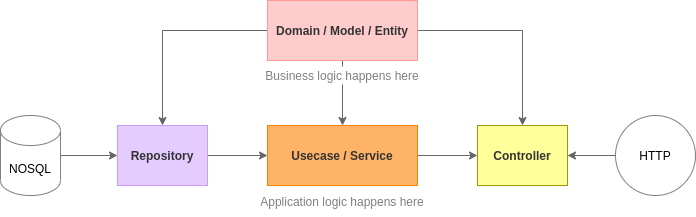

# Clean architecture in Go
This project is a simple sample of a implementation Clean Architecture in GoLang.

<br/>

## Use case 
User API : this API is responsible by management users. With it us going to create and search users.

<br/>

## Layers
<li>Domain / Model</li>
<li>Usecase / Service</li>
<li>Controller</li>
<li>Repository</li>

<br/>



<br/>

## Runing API

```bash

# move to directory
cd workspace

# clone into your $GOPATH/src
git clone https://github.com/pablomedeiross/go-clean-architecture.git

# move to project 
cd go-clean-architecture

# run application
go run main.go 

```
