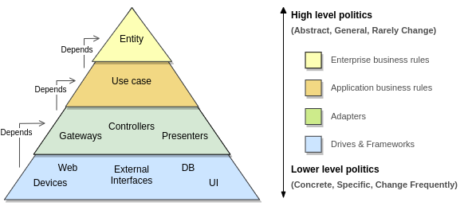

# Architecture
This section seeks explain a little more about clean architecture.

 

 

## Summary
This image is a summary of concepts, relationships and responsibilities of the existenting layers.
With it in mind let's talk about the following topics:

- [Principles](#Principles)
- [Concepts](#Concepts)
- [Layers](#Layers)
- [Relationships](#Relationships)
- [Rules](#Rules)
- [More about](#Moreabout)

 

### Principles
The principles that guide this architecture are:
- SoC (separation of concerns)
- Use cases how first class citizens
- Dependency injection
- Testability

### Concepts
Existem alguns conceitos que são importantes de conhecermos antes de seguirmos analisando as próximas seções.

 

#### Politics
Sistemas de software são declações de política. Em essência isso expressa o que um programa de computador realmente é. Um programa de computador é uma descrição detalhada de uma política que coordena a transformação de entradas e saídas.

#### High level politics
Quanto mais afastadas das entradas e saídas mais alto é o nível da política. Geralmente esse tipo de política descreve fluxos mais abstratos. Elas tendem a mudar menos frequentemente mas por razões mais substânciais. 

#### Low level politics
As politicas que lidam com entradas e saídas do sistema são as políticas de nível mais baíxo do sistema.
As politicas de baixo nível são responsáveis por lidar com entradas e saídas do sistema.
Esse tipo de política tende a mudar com mais frequência e por razões menos substânciais em função de estar mais próximo de I/O.

#### Enterprise business rules
Esse tipo de regra deve ser o coração do sistema. Elas fazem parte das políticas de nível mais alto do sistema e deveriam ser a parte mais reutilizavel dele. Elas dizem respeito a regras que são responsáveis por gerar ou economizar o dinheiro da empresa, existiram mesmo que não houvesse um sistema automatizado.
Exemplo: a cobrança de N% de juros por um empréstimo é uma regra de negócio que gera receita para o banco e existiria sem um sistema automatizado.

#### Application business rules
Nem todas as regras de negócio são tão puras, algumas delas geram ou economizam dinheiro para empresa ao definirem a forma como um sistema automatizado opera. Essas regras não seriam usadas em um ambiente manual, pois só fazem sentido como parte de um sistema automatizado. São políticas de nível inferior as regras de negócio por se tratar de fatos não tão cruciais.
Exemplo: O controle de quem deve ou não visualizar uma tela do sistema em alguma tela.

 

## Layers

 

## Relationship bettwen layers

 

## Rules
- The modules more externals should depend of the more internals, but never the opposite.
- The limits between layers should be explicit.
- Frameworks are a detail.

 

## More about