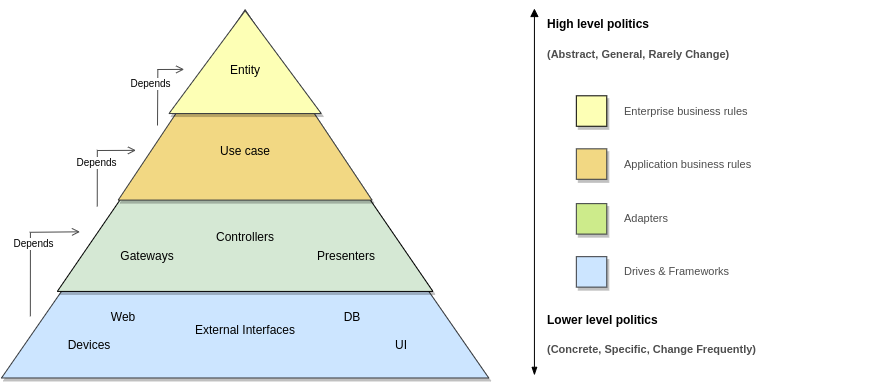

# Clean Architecture
This section seeks explain a little more about clean architecture.

 

 

## Summary
This image is a summary of concepts, relationships and responsibilities of the existenting layers.
With it in mind let's talk about the following topics:

- [Purpose](#Purpose)
- [Principles](#Principles)
- [Layers](#Layers)
- [Concepts](#Concepts)
- [More about](#Moreabout)

 

## Purpose 
How objective this architecture seek solve or improve the following points:

- structure expressivity (Tornar mais claro o problema que a aplicação busca resolver)
- maintenance 
- testability
- decoupling of business solve from Frameworks and drives

 

## Principles
The principles that guide this architecture are:

- SoC (separation of concerns)
- Use cases how first class citizens
- SOLID 
- Testability

 

## Layers
Um resumo que busca esclarecer o que cada camada contém, quais suas relações, o que você precisa evitar em cada uma delas e seu nível.

### Entity

O que há nessa camada: 
- [Business rules](#Enterprise_business_rules) que existiram mesmo que não houvesse sistema automatizado. 
- Dados cruciais de negócio que existiriam mesmo que não houvesse sistema automatizado.

Com quem se relaciona:

- Essa é a camada mais autocontida do sistema, ela não deve se relacionar com nenhuma outra camada além da própria linguagem ou bibliotecas que facilitem a escrita dela.

O que você deve evitar:
- Incluir referências a frameworks e drives ou as outras camadas do sistema.
- Incluir regras que só existem em função de um sistema computacional.

Nível: [High](#High_level), na verdade o mais alto do sistema.

### Use_case

O que há nessa camada: 
- [Application business rules](#Application_business_rules), regras que existem apena em função de um sistema automatizado.
- Controle de fluxo para realização de um caso de uso, relações entre entidades..
- Especificação do que entra e saída da aplicação.

Com quem se relaciona:
- Essa camada se relaciona apenas com a camada [entity](#Entity), lembrando que a camada mais abaixo se relaciona com a camada mais acima.

O que você deve evitar:
- Incluir [Business rules](#Enterprise_business_rules) que existiram mesmo que não houvesse sistema automatizado. 
- Incluir referências a frameworks e drives ou as outras camadas do sistema.
- Utilizar entities como objetos de entrada e saída

Nível: [High](#High_level), mas inferior a camada [Entity](#Entity).

### Adapters_of_interfaces

O que há nessa camada: 
- Aqui nós encontramos adaptadores que irão realizar a ligação entre a aplicação e interfaces externas.
- Conversão de dados de entrada do usuário para os formatos do caso e vice e versa.

Com quem se relaciona:
- Essa camada se relaciona com as camadas [use case](#Use_case) e [entity](#Entity)

O que você deve evitar:
- Incluir [Business rules](#Enterprise_business_rules) que existiram mesmo que não houvesse sistema automatizado. 
- Incluir [Application business rules](#Application_business_rules), regras que existem apenas em função de um sistema automatizado.

Nível: [Low](#Low_level), pois lida diretamente com as entradas e saídas do usuário.

### External_interfaces

O que há nessa camada: 
- Frameworks, ferramentas como base de dados e web.
- Algumas configurações para criar a associação com as camadas mais acima dela.

Com quem se relaciona:
- Se relaciona com as camadas de nível mais alto.

Nível: [Low](#Low_level), pois lida diretamente com as entradas e saídas do usuário.

 

## Concepts
Alguns conceitos relacionados a arquitetura para tornar mais claro alguns pontos listados nos tópicos acima.

### Policies
Software systems are statements of politics. In essence this mean what a program of computer really is. A program of computer is a description detail of a political that coordinates the transformations of input and output.

#### High_level
How much more away of inputs and outputs more high is politic's level. Generally this type of politic describe flows more abstracts. It tend change with less frequency but for reasons more substantial.\
Example: Changes in calculate of interest of enterprise.

#### Low_level
The policies that cope with inputs and outputs from system are policies of more low level of the system. These policies tend to change more frequently for less substantial reasons because they are closer to I / O.\
Examples: Change of database, changes in UI. 

### Enterprise_business_rules
These rules must are the system's hearth. They're part of high level policies from system and should was the part more reusable of it. They concern the rules that are responsible for generate or save the money from enterprise, they exist even don't exist an automatized system.\
Example: The collection of N% of interest by a loan is a rule of business tha generate receive for the bank and exist without a automatized system.

### Application_business_rules
Not all business rules are so pure, some of them generate or save money for the company by defining the way an automated system operates. These rules can't be used in a manual environment, because they only make sense as part of an automated system. These policies are low than the business rule by treat of facts not so crucial.\
Example: The control of who could or not view a interface of system.

 

## More_about
- [Explain about my implemanttion of clean architecture](my-implementation.md)
- [Uncle Bob post about Clean architecture](http://blog.cleancoder.com/uncle-bob/2012/08/13/the-clean-architecture.html)
- [Clean architecture Book](https://www.amazon.com/Clean-Architecture-Craftsmans-Software-Structure/dp/0134494164/ref=sr_1_1?__mk_pt_BR=%C3%85M%C3%85%C5%BD%C3%95%C3%91&dchild=1&keywords=Clean+architecture&qid=1611414455&sr=8-1)
