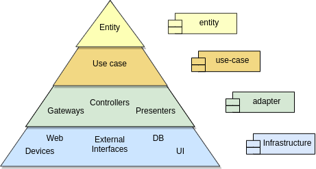

# My implementation of clean architecture
Este é um visual que busca esclarecer como a aplicação implementa a arquitetura limpa.

 

## Modules and layers

A implementação atual da aplicação contem os seguintes módulos:

- entity
- use-case
- adapter
- infrastructure

Na imagem abaixo podemo ver quais módulos implementam as camadas da arquitetura limpa.

[Para saber mais sobre as camadas da arquitetura limpa](clean-architecture.md)

 

## Relationship
Na imagem abaixo podemos ver um exemplo de como as camadas da aplicação se relacionam seguindo a regra de dependência.

 

 
