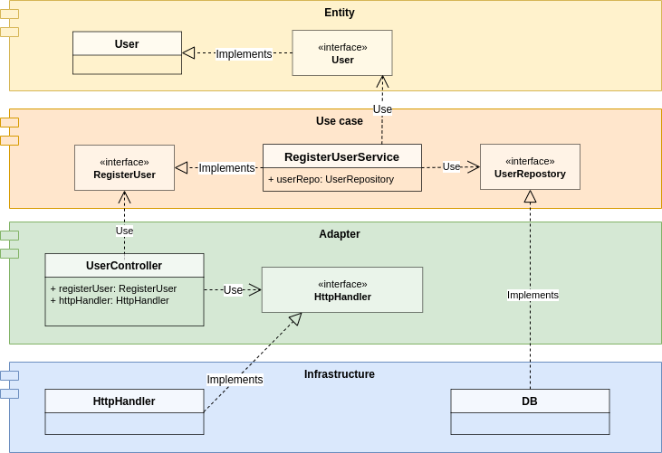

# My implementation of clean architecture
Este é um visual que busca esclarecer como a aplicação implementa a arquitetura limpa.

 

## Clean architecture layers and impementation modules
Abaixo a relação das camadas da arquitetura limpa com os módulos criados na aplicação.

| Clean architecture layer | My module      |
|--------------------------|----------------|
| Entity                   | entity         |
| Use case                 | use-case       |
| Adapters of Interfaces   | adapter        |
| External interfaces      | infrastructure |

 

## Relationship
Além de apresentar a relação dos módulos com as camadas da arquitetura limpa é importante demonstrar como os módulos interagem uns com os outros e quais são suas fronteiras. Abaixo podemos analisar esses pontos de forma visual.

 

 

## Request flow
